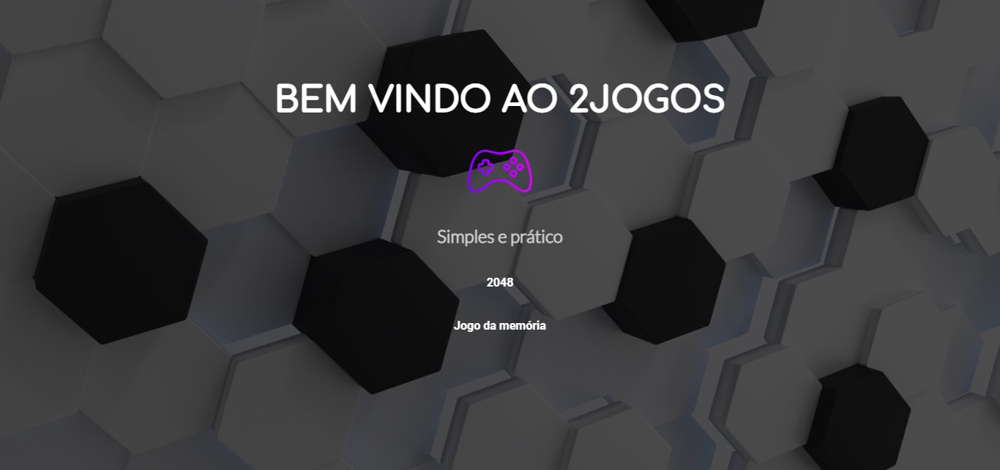
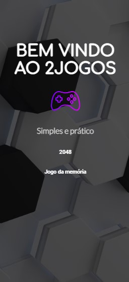
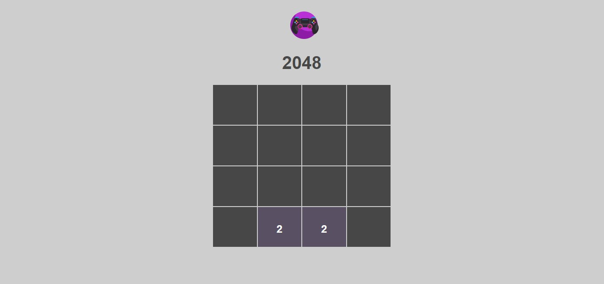
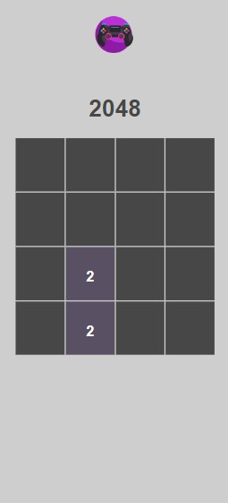
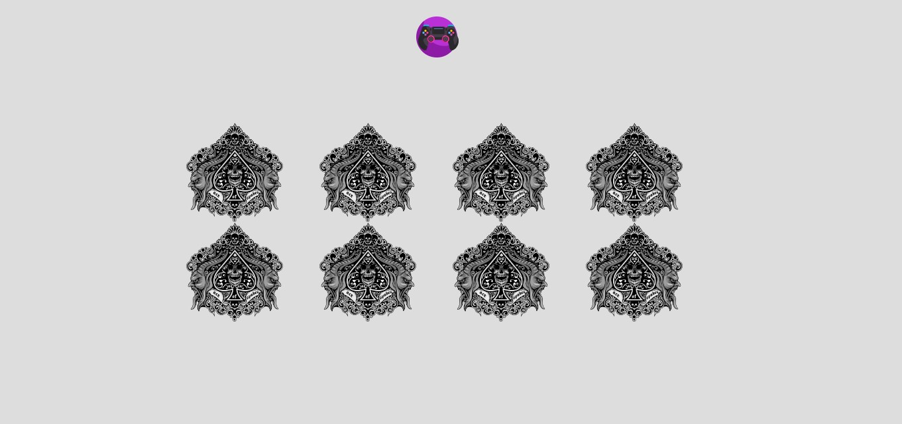
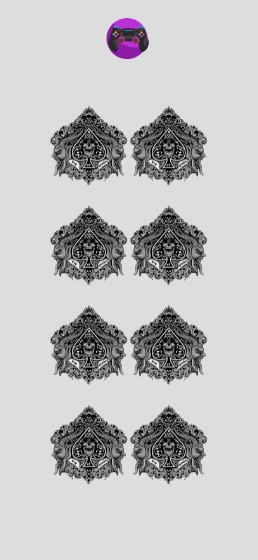

# Projeto 5º Semestre - Ciências da Computação UNINOVE

## Disciplina: Projeto de Sistemas Interativos

Bem-vindo ao repositório do projeto do 5º semestre de Ciências da Computação na UNINOVE. Este projeto foi desenvolvido como parte da disciplina de Projeto de Sistemas Interativos e inclui a criação de um site com dois jogos interativos.

## Visão Geral

Nosso projeto consiste em um site que oferece acesso a dois jogos interativos criados pelos integrantes do grupo. Os jogos foram desenvolvidos como parte de nosso estudo e prática na disciplina citada.

## Jogos Disponíveis

1. **Home page - [2jogos](https://2jogos-eight.vercel.app/)**

   
   

2. **Jogo 1 - [2048](https://2jogos-eight.vercel.app/2048.html)**

   
   

3. **Jogo 2 - [Jogo da memória](https://2jogos-eight.vercel.app/memoria.html)**

   
   

## Autores

- [Felipe Santos Gomes da Silva](https://github.com/Felipe8959)
